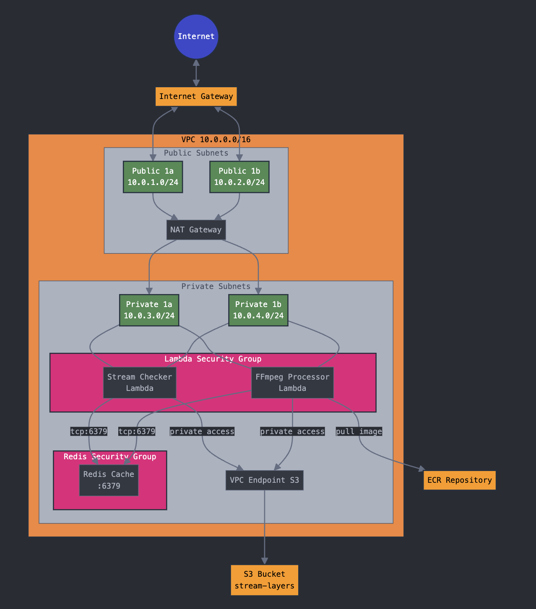

# AWS Stream Processing Infrastructure Setup

## Overview

Infrastructure for processing video streams using two Lambda functions:

- `stream-checker`: Polls video stream every 2 seconds
- `ffmpeg-processor`: Processes video segments using FFmpeg layer



## Prerequisites

- AWS CLI configured
- Python 3.11+
- Existing S3 bucket: `stream-layers`

## Setup Steps

### 1. IAM Setup

```bash
# Delete existing roles (if needed)
aws iam delete-role-policy --role-name stream-checker-role --policy-name stream-checker-policy
aws iam detach-role-policy --role-name stream-checker-role --policy-arn arn:aws:iam::aws:policy/service-role/AWSLambdaVPCAccessExecutionRole
aws iam delete-role --role-name stream-checker-role

aws iam delete-role-policy --role-name ffmpeg-processor-role --policy-name ffmpeg-processor-policy
aws iam detach-role-policy --role-name ffmpeg-processor-role --policy-arn arn:aws:iam::aws:policy/service-role/AWSLambdaVPCAccessExecutionRole
aws iam delete-role --role-name ffmpeg-processor-role

aws iam delete-role-policy --role-name codebuild-ffmpeg-role --policy-name codebuild-ffmpeg-policy
aws iam delete-role --role-name codebuild-ffmpeg-role

# Stream Checker Lambda Role
aws iam create-role --role-name stream-checker-role \
    --assume-role-policy-document '{
        "Version": "2012-10-17",
        "Statement": [{
            "Effect": "Allow",
            "Principal": {"Service": "lambda.amazonaws.com"},
            "Action": "sts:AssumeRole"
        }]
    }' --profile matrix

# FFmpeg Processor Lambda Role
aws iam create-role --role-name ffmpeg-processor-role \
    --assume-role-policy-document '{
        "Version": "2012-10-17",
        "Statement": [{
            "Effect": "Allow",
            "Principal": {"Service": "lambda.amazonaws.com"},
            "Action": "sts:AssumeRole"
        }]
    }' --profile matrix

# CodeBuild Role
aws iam create-role --role-name codebuild-ffmpeg-role \
    --assume-role-policy-document '{
        "Version": "2012-10-17",
        "Statement": [{
            "Effect": "Allow",
            "Principal": {"Service": "codebuild.amazonaws.com"},
            "Action": "sts:AssumeRole"
        },
        {
            "Effect": "Allow",
            "Action": [
                "ecr:GetAuthorizationToken",
                "ecr:BatchCheckLayerAvailability",
                "ecr:GetDownloadUrlForLayer",
                "ecr:BatchGetImage",
                "ecr:InitiateLayerUpload",
                "ecr:UploadLayerPart",
                "ecr:CompleteLayerUpload",
                "ecr:PutImage"
            ],
            "Resource": "*"
        }]
    }' --profile matrix

# Attach Policies
aws iam put-role-policy --role-name stream-checker-role \
    --policy-name stream-checker-policy \
    --policy-document '{
        "Version": "2012-10-17",
        "Statement": [
            {
                "Effect": "Allow",
                "Action": [
                    "logs:CreateLogGroup",
                    "logs:CreateLogStream",
                    "logs:PutLogEvents",
                    "ec2:CreateNetworkInterface",
                    "ec2:DescribeNetworkInterfaces",
                    "ec2:DeleteNetworkInterface",
                    "lambda:InvokeFunction"
                ],
                "Resource": "*"
            }
        ]
    }' --profile matrix

aws iam put-role-policy --role-name ffmpeg-processor-role \
    --policy-name ffmpeg-processor-policy \
    --policy-document '{
        "Version": "2012-10-17",
        "Statement": [
            {
                "Effect": "Allow",
                "Action": [
                    "logs:CreateLogGroup",
                    "logs:CreateLogStream",
                    "logs:PutLogEvents",
                    "ec2:CreateNetworkInterface",
                    "ec2:DescribeNetworkInterfaces",
                    "ec2:DeleteNetworkInterface",
                    "s3:GetObject",
                    "ecr:GetAuthorizationToken",
                    "ecr:BatchGetImage",
                    "ecr:GetDownloadUrlForLayer"
                ],
                "Resource": "*"
            }
        ]
    }' --profile matrix

aws iam put-role-policy --role-name codebuild-ffmpeg-role \
    --policy-name codebuild-ffmpeg-policy \
    --policy-document '{
        "Version": "2012-10-17",
        "Statement": [
            {
                "Effect": "Allow",
                "Action": [
                    "s3:PutObject",
                    "s3:GetObject",
                    "s3:GetObjectVersion",
                    "logs:CreateLogGroup",
                    "logs:CreateLogStream",
                    "logs:PutLogEvents"
                ],
                "Resource": "*"
            }
        ]
    }' --profile matrix

aws iam attach-role-policy --role-name stream-checker-role \
    --policy-arn arn:aws:iam::aws:policy/service-role/AWSLambdaVPCAccessExecutionRole --profile matrix

aws iam attach-role-policy --role-name ffmpeg-processor-role \
    --policy-arn arn:aws:iam::aws:policy/service-role/AWSLambdaVPCAccessExecutionRole --profile matrix

# Store role ARNs
STREAM_CHECKER_ROLE_ARN=$(aws iam get-role --role-name stream-checker-role --query 'Role.Arn' --output text --profile matrix)
PROCESSOR_ROLE_ARN=$(aws iam get-role --role-name ffmpeg-processor-role --query 'Role.Arn' --output text --profile matrix)
CODEBUILD_ROLE_ARN=$(aws iam get-role --role-name codebuild-ffmpeg-role --query 'Role.Arn' --output text --profile matrix)
```

### 2. VPC Setup

```bash
# Create VPC
VPC_ID=$(aws ec2 create-vpc \
    --cidr-block 10.0.0.0/16 \
    --tag-specifications 'ResourceType=vpc,Tags=[{Key=Name,Value=stream-vpc}]' \
    --query 'Vpc.VpcId' \
    --output text --profile matrix)

# Create subnets
PUBLIC_SUBNET_1A=$(aws ec2 create-subnet \
    --vpc-id $VPC_ID \
    --cidr-block 10.0.1.0/24 \
    --availability-zone us-east-1a \
    --tag-specifications 'ResourceType=subnet,Tags=[{Key=Name,Value=public-1a}]' \
    --query 'Subnet.SubnetId' \
    --output text --profile matrix)

PUBLIC_SUBNET_1B=$(aws ec2 create-subnet \
    --vpc-id $VPC_ID \
    --cidr-block 10.0.2.0/24 \
    --availability-zone us-east-1b \
    --tag-specifications 'ResourceType=subnet,Tags=[{Key=Name,Value=public-1b}]' \
    --query 'Subnet.SubnetId' \
    --output text --profile matrix)

PRIVATE_SUBNET_1A=$(aws ec2 create-subnet \
    --vpc-id $VPC_ID \
    --cidr-block 10.0.3.0/24 \
    --availability-zone us-east-1a \
    --tag-specifications 'ResourceType=subnet,Tags=[{Key=Name,Value=private-1a}]' \
    --query 'Subnet.SubnetId' \
    --output text --profile matrix)

PRIVATE_SUBNET_1B=$(aws ec2 create-subnet \
    --vpc-id $VPC_ID \
    --cidr-block 10.0.4.0/24 \
    --availability-zone us-east-1b \
    --tag-specifications 'ResourceType=subnet,Tags=[{Key=Name,Value=private-1b}]' \
    --query 'Subnet.SubnetId' \
    --output text --profile matrix)

# Internet Gateway
IGW_ID=$(aws ec2 create-internet-gateway \
    --query 'InternetGateway.InternetGatewayId' \
    --output text --profile matrix)

aws ec2 attach-internet-gateway --vpc-id $VPC_ID --internet-gateway-id $IGW_ID --profile matrix

# Elastic IP for NAT Gateway
EIP_ID=$(aws ec2 allocate-address \
    --domain vpc \
    --query 'AllocationId' \
    --output text --profile matrix)

# NAT Gateway
NAT_GW_ID=$(aws ec2 create-nat-gateway \
    --subnet-id $PUBLIC_SUBNET_1A \
    --allocation-id $EIP_ID \
    --query 'NatGateway.NatGatewayId' \
    --output text --profile matrix)

# Wait for NAT Gateway
aws ec2 wait nat-gateway-available --nat-gateway-ids $NAT_GW_ID --profile matrix

# Route Tables
PUBLIC_RTB_ID=$(aws ec2 create-route-table \
    --vpc-id $VPC_ID \
    --query 'RouteTable.RouteTableId' \
    --output text --profile matrix)

PRIVATE_RTB_ID=$(aws ec2 create-route-table \
    --vpc-id $VPC_ID \
    --query 'RouteTable.RouteTableId' \
    --output text --profile matrix)

# Routes
aws ec2 create-route \
    --route-table-id $PUBLIC_RTB_ID \
    --destination-cidr-block 0.0.0.0/0 \
    --gateway-id $IGW_ID --profile matrix

aws ec2 create-route \
    --route-table-id $PRIVATE_RTB_ID \
    --destination-cidr-block 0.0.0.0/0 \
    --nat-gateway-id $NAT_GW_ID --profile matrix

# Route Table Associations
aws ec2 associate-route-table --subnet-id $PUBLIC_SUBNET_1A --route-table-id $PUBLIC_RTB_ID --profile matrix
aws ec2 associate-route-table --subnet-id $PUBLIC_SUBNET_1B --route-table-id $PUBLIC_RTB_ID --profile matrix
aws ec2 associate-route-table --subnet-id $PRIVATE_SUBNET_1A --route-table-id $PRIVATE_RTB_ID --profile matrix
aws ec2 associate-route-table --subnet-id $PRIVATE_SUBNET_1B --route-table-id $PRIVATE_RTB_ID --profile matrix

# VPC Endpoint for S3
aws ec2 create-vpc-endpoint \
    --vpc-id $VPC_ID \
    --service-name com.amazonaws.us-east-1.s3 \
    --route-table-ids $PRIVATE_RTB_ID --profile matrix

# Security Groups
LAMBDA_SG_ID=$(aws ec2 create-security-group \
    --group-name lambda-sg \
    --description "Lambda security group" \
    --vpc-id $VPC_ID \
    --query 'GroupId' \
    --output text --profile matrix)

REDIS_SG_ID=$(aws ec2 create-security-group \
    --group-name redis-sg \
    --description "Redis security group" \
    --vpc-id $VPC_ID \
    --query 'GroupId' \
    --output text --profile matrix)

NAT_SG_ID=$(aws ec2 create-security-group \
    --group-name nat-sg \
    --description "NAT Gateway security group" \
    --vpc-id $VPC_ID \
    --query 'GroupId' \
    --output text --profile matrix)

# Security Group Rules
aws ec2 authorize-security-group-ingress \
    --group-id $REDIS_SG_ID \
    --protocol tcp \
    --port 6379 \
    --source-group $LAMBDA_SG_ID --profile matrix

aws ec2 authorize-security-group-ingress \
    --group-id $NAT_SG_ID \
    --protocol -1 \
    --port -1 \
    --source-group $LAMBDA_SG_ID --profile matrix
```

### 3. Redis Setup

```bash
# Create subnet group
CACHE_SUBNET_GROUP=$(aws elasticache create-cache-subnet-group \
    --cache-subnet-group-name stream-cache-subnet \
    --subnet-ids $PRIVATE_SUBNET_1A $PRIVATE_SUBNET_1B \
    --cache-subnet-group-description "Subnet group for stream cache" \
    --query 'CacheSubnetGroup.CacheSubnetGroupName' \
    --output text --profile matrix)

# Create Redis cluster
REDIS_ENDPOINT=$(aws elasticache create-cache-cluster \
    --cache-cluster-id stream-cache \
    --engine redis \
    --cache-node-type cache.t3.micro \
    --num-cache-nodes 1 \
    --cache-subnet-group-name $CACHE_SUBNET_GROUP \
    --security-group-ids $REDIS_SG_ID \
    --query 'CacheCluster.CacheNodes[0].Endpoint.Address' \
    --output text --profile matrix)

# Wait for Redis to be available
aws elasticache wait cache-cluster-available --cache-cluster-id stream-cache --profile matrix

# Get Redis endpoint after cluster is ready
REDIS_ENDPOINT=$(aws elasticache describe-cache-clusters \
    --cache-cluster-id stream-cache \
    --show-cache-node-info \
    --query 'CacheClusters[0].CacheNodes[0].Endpoint.Address' \
    --output text --profile matrix)
```

### 4. Lambda Layer Setup

```bash
# Create FFmpeg layer
cd ffmpeg-layer
zip -r ../ffmpeg-layer.zip .
aws s3 cp ffmpeg-layer.zip s3://stream-layers/ --profile matrix

aws ecr create-repository --repository-name lambda-ffmpeg-processor --profile matrix
aws ecr set-repository-policy \
    --repository-name lambda-ffmpeg-processor \
    --policy-text '{
        "Version": "2012-10-17",
        "Statement": [
            {
                "Sid": "LambdaECRImageRetrievalPolicy",
                "Effect": "Allow",
                "Principal": {
                    "Service": "lambda.amazonaws.com"
                },
                "Action": [
                    "ecr:BatchGetImage",
                    "ecr:GetDownloadUrlForLayer"
                ]
            }
        ]
    }' --profile matrix

# Create CodeBuild project
CODEBUILD_PROJECT=$(aws codebuild create-project \
    --name ffmpeg-layer-builder \
    --source type=S3,location=stream-layers/ffmpeg-layer.zip \
    --artifacts type=NO_ARTIFACTS \
    --environment type=LINUX_CONTAINER,image=aws/codebuild/amazonlinux2-x86_64-standard:4.0,computeType=BUILD_GENERAL1_SMALL \
    --service-role $CODEBUILD_ROLE_ARN \
    --query 'project.name' \
    --output text --profile matrix)

# Start build and wait for completion
BUILD_ID=$(aws codebuild start-build \
    --project-name $CODEBUILD_PROJECT \
    --query 'build.id' \
    --output text --profile matrix)

aws codebuild wait build-complete --ids $BUILD_ID --profile matrix
```

### 5. Lambda Functions Setup

```bash
# Stream Checker Lambda
cd stream-checker
pip install -r requirements.txt --target .
zip -r ../stream-checker.zip .

STREAM_CHECKER_ARN=$(aws lambda create-function \
    --function-name stream-checker \
    --runtime python3.11 \
    --handler lambda_function.handler \
    --role $STREAM_CHECKER_ROLE_ARN \
    --zip-file fileb://stream-checker.zip \
    --vpc-config SubnetIds=$PRIVATE_SUBNET_1A,$PRIVATE_SUBNET_1B,SecurityGroupIds=$LAMBDA_SG_ID \
    --environment Variables="{REDIS_URL=redis://$REDIS_ENDPOINT}" \
    --query 'FunctionArn' \
    --output text --profile matrix)

# FFmpeg Processor Lambda
PROCESSOR_LAMBDA_ARN=$(aws lambda create-function \
    --function-name ffmpeg-processor \
    --package-type Image \
    --code ImageUri=804298342443.dkr.ecr.us-east-1.amazonaws.com/lambda-ffmpeg-processor:latest \
    --role $PROCESSOR_ROLE_ARN \
    --timeout 30 \
    --vpc-config SubnetIds=$PRIVATE_SUBNET_1A,$PRIVATE_SUBNET_1B,SecurityGroupIds=$LAMBDA_SG_ID \
    --environment Variables="{REDIS_URL=redis://$REDIS_ENDPOINT}" \
    --query 'FunctionArn' \
    --output text --profile matrix)

# Update Stream Checker with Processor ARN
aws lambda update-function-configuration \
    --function-name stream-checker \
    --environment Variables="{REDIS_URL=redis://$REDIS_ENDPOINT,PROCESSOR_LAMBDA_ARN=$PROCESSOR_LAMBDA_ARN}" --profile matrix
```

### 6. Testing

```bash
aws lambda invoke \
    --function-name stream-checker \
    --invocation-type RequestResponse \
    --log-type Tail \
    --profile matrix \
    output.json

aws logs tail /aws/lambda/ffmpeg-processor --follow

# Test Redis connectivity
python3 -c "
import redis
r = redis.from_url('$REDIS_ENDPOINT')
print(r.ping())
"
```
